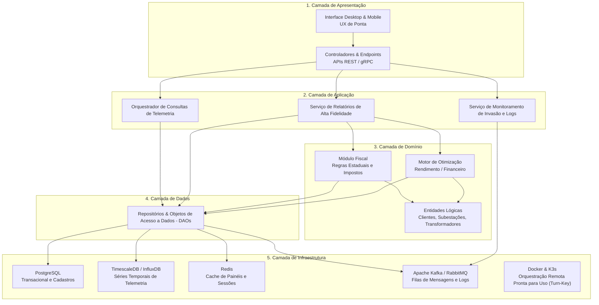

# Resumo da Semana T02

## 1. Atividade 1 — Requisitos de Software
Detalhamento do documento de visão do produto aplicado ao caso do Spotify, mapeando as bolhas de recomendação e a falta de filtros ativos (blacklist). O estudo também delineia a arquitetura viável baseada em microagentes assíncronos e propõe a otimização de custos através do aproveitamento da equipe atual especializada em Java.

---

## 2. Atividade 2 — Modelagem de Arquitetura (Gird The Grid)

Abaixo, a representação da arquitetura estruturada para o cenário "Gird The Grid", dividida nas cinco camadas principais de operação e responsabilidade:

### Justificativa Técnica da Arquitetura
A arquitetura em 5 camadas proposta atende com rigor científico e alta escalabilidade aos exigentes requisitos do Kata "Gird The Grid" ao desacoplar de forma estrita as responsabilidades de negócio de sua infraestrutura tecnológica. Para suportar o volume de dados de até 1.900.000 consumidores com a **confiabilidade exigida de 99,99%** (quatro noves), o Serviço de Telemetria utiliza uma "via expressa" direta para consulta rápida no banco de séries temporais (TimescaleDB/InfluxDB) apoiada por uma camada de cache de alta velocidade (Redis). A **segurança** é tratada como cidadã de primeira classe: o Serviço de Monitoramento de Invasão realiza o enfileiramento assíncrono de logs e alertas no barramento de mensageria (Apache Kafka/RabbitMQ), impedindo que picos de conexões maliciosas causem indisponibilidade no banco de dados. Por fim, o empacotamento com Docker aliado à orquestração leve do K3s fornece a infraestrutura ideal para viabilizar **distribuições comerciais rápidas e totalmente automatizadas (turn-key)** nos servidores locais descentralizados das distribuidoras.

---

## 3. Resumo das Aulas de Apoio
Consolidação dos conceitos discutidos em aula, focando em:
* **Separação de Responsabilidades:** Diferenciação entre padrões arquiteturais e de design (MVC vs. Arquitetura em Camadas).
* **Acoplamento:** Estratégias para minimizar dependências entre módulos e garantir a coesão do domínio.
* **Organização de Projetos:** Análise comparativa entre as estruturas de pacotes *Package by Layer* (agrupamento por tipo técnico) e *Package by Feature* (agrupamento por funcionalidade de negócio).

---

## 4. Checklist de Envio
Antes de submeter a atividade da semana, verifique se todos os itens abaixo foram concluídos e anexados:

- [x] Detalhamento do documento de visão do produto (Caso Spotify).
- [x] Análise sobre bolhas de recomendação e implementação de blacklist.
- [x] Diagrama da Arquitetura em 5 Camadas exportado ou embutido (Mermaid).
- [x] Justificativa técnica (Focada em disponibilidade, segurança e deploy turn-key).
- [x] Resumo conceitual de MVC, Camadas e estruturas de pacotes.