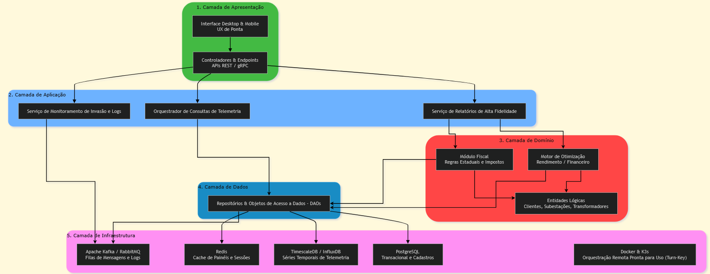

# SemanaT02.2

## 1. Recapitulação do Kata: Gird The Grid

Uma empresa que desenvolve software de gerenciamento para redes elétricas precisa atualizar sua solução desatualizada e planeja vender sua oferta como uma plataforma.

**Usuários:** Empresas de energia elétrica de pequeno e médio porte, capazes de acomodar redes elétricas de 100.000 a 1.900.000 clientes.

**Requisitos:**
* Configurável para características específicas da distribuidora (estado, taxas de impostos, etc.).
* Experiência de usuário (UX) de ponta.
* Painéis (dashboards) com relatórios analíticos usando dados em tempo quase real da rede.
* Excelentes capacidades de geração de relatórios.
* Motor analítico sofisticado para determinar a melhor relação rendimento/custo.
* Administração através de dispositivos desktop ou mobile.
* Relatórios de tentativas de invasão e segurança.

**Contexto Adicional:**
* Confiabilidade de 99,99% (quatro noves).
* Implantação pronta para uso (turn-key) em sites remotos locais.
* A segurança é uma preocupação de primeira classe.
* A empresa deseja mudar do gerenciamento de redes elétricas para se tornar uma revendedora de software.

---

## 2. Justificativa para o Uso do Diagrama de Camadas

A escolha por representar a arquitetura através de um diagrama de camadas (Layered Architecture) deve-se à necessidade de demonstrar visualmente a estrita separação de responsabilidades e o fluxo de dependências do sistema. Em um projeto com regras de negócio críticas e altamente mutáveis (como cálculos de impostos estaduais e motores de otimização de custos), é fundamental comprovar para os *stakeholders* que o **Domínio** está protegido e independente. O diagrama ilustra de forma clara que as dependências fluem de cima para baixo (do front-end e aplicação para o domínio e dados), garantindo que a interface do usuário e a infraestrutura tecnológica orbitam o núcleo do negócio sem acoplá-lo, o que facilita a escalabilidade, manutenção e segurança.

---

## 3. Justificativa Completa da Arquitetura Escolhida

A arquitetura em 5 camadas proposta atende com rigor científico e alta escalabilidade aos exigentes requisitos do Kata "Gird The Grid" ao desacoplar de forma estrita as responsabilidades de negócio de sua infraestrutura tecnológica. A estrutura baseia-se nos seguintes pilares:

### 3.1. Isolamento de Domínio e Adaptabilidade
O fluxo de dependências estruturado de cima para baixo garante o isolamento do domínio, mantendo as Entidades Lógicas como objetos passivos e delegando a responsabilidade de persistência aos Repositórios. Isso atende ao requisito de uma plataforma configurável (estado, taxas), pois as regras fiscais e o motor de otimização de rendimento/custo residem blindados na Camada de Domínio, sem contaminação pelas tecnologias de persistência.

### 3.2. Escalabilidade e Telemetria em Tempo Quase Real
Para suportar o volume de dados de até 1.900.000 consumidores com a confiabilidade exigida de 99,99% (quatro noves), o Serviço de Telemetria utiliza uma "via expressa" direta para consulta rápida. O uso de um banco de séries temporais (TimescaleDB/InfluxDB) apoiado por uma camada de cache de alta velocidade (Redis) viabiliza os dashboards analíticos exigidos com dados em tempo quase real.

### 3.3. Segurança e Resiliência como Primeira Classe
Como a segurança é uma preocupação central, o Serviço de Monitoramento de Invasão realiza o enfileiramento assíncrono de logs e alertas de tentativa de penetração no barramento de mensageria (Apache Kafka/RabbitMQ). Essa estratégia impede que picos de conexões maliciosas sobrecarreguem ou causem indisponibilidade no banco de dados transacional (PostgreSQL), garantindo a resiliência do sistema.

### 3.4. Infraestrutura Descentralizada e Distribuição Turn-key
A migração do modelo de negócios para revenda de software exige uma implantação replicável. O empacotamento com Docker aliado à orquestração leve do K3s fornece a infraestrutura ideal para viabilizar distribuições comerciais rápidas e totalmente automatizadas (turn-key) nos servidores locais descentralizados (remote sites) das distribuidoras de energia. A Camada de Apresentação com APIs REST/gRPC garante suporte fluido tanto para UX de ponta no desktop quanto no mobile.