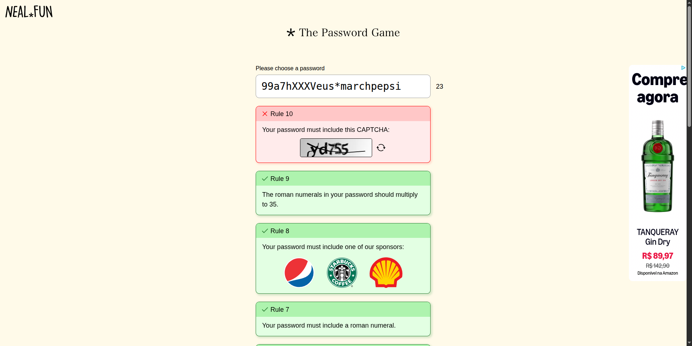
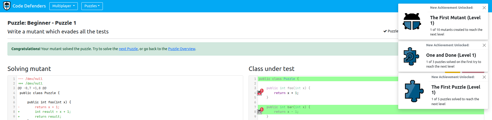
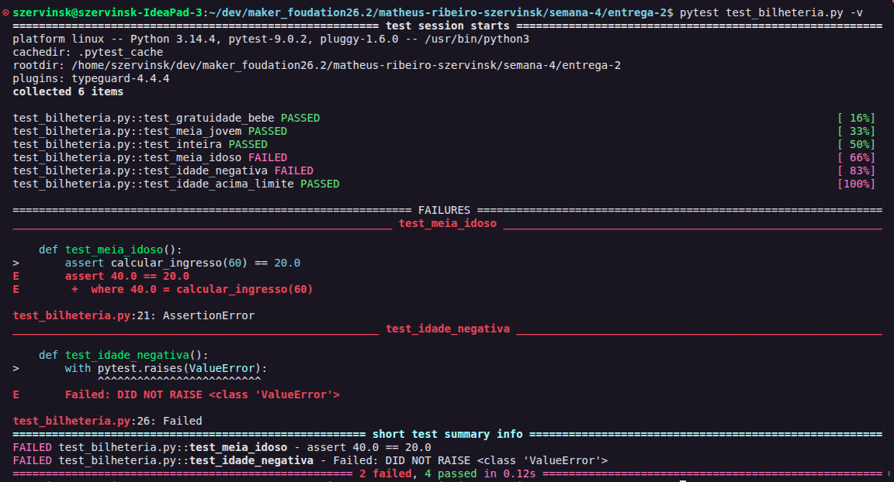
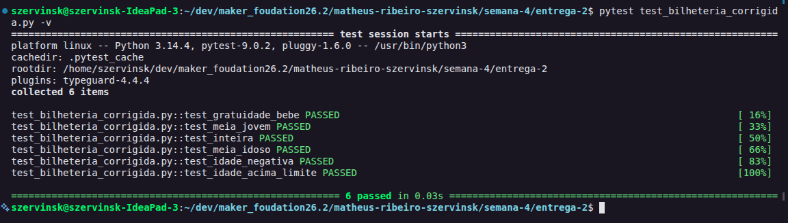

# Semana 4

## Relatório de Atividades - Entregas 1 e 2: Testes e Qualidade de Software

**Nome:** Matheus Ribeiro Szervinsk | **Matrícula:** 231011749 | **Ciclo:** 1 | **Semana:** 4

**Repositório Oficial:** `AI-Lab-UnB/maker_foudation26.2`

---

### Resumo da Atividade

Durante a quarta semana, o foco das atividades práticas esteve centrado nos fundamentos de **Engenharia de Qualidade de Software (QA)**, técnicas de teste de caixa-preta, automação com **Pytest** e redação técnica de relatórios de defeitos (*Bug Reports*).

A formação foi dividida em duas grandes entregas:
1. **Entrega 1 (Mentalidade de Testes e Caixa-Preta):** Consolidação dos conceitos de qualidade e ciclo de vida de testes; atividades gamificadas de raciocínio em condições de contorno (*The Password Game*) e teste de mutação (*Code Defenders*); e o projeto formal de uma matriz de casos de teste utilizando **Particionamento de Equivalência (EP)** e **Análise de Valor Limite (BVA)** para a bilheteria de um museu.
2. **Entrega 2 (Diagnóstico de Código e Bug Report):** Execução prática de testes automatizados via terminal utilizando `pytest` contra uma implementação real com defeitos em Python (`bilheteria.py`); diagnóstico e elaboração formal de *Bug Reports* padronizados para as falhas encontradas; e resolução do **Desafio Ninja**, com a refatoração do código até a aprovação de 100% da suíte de testes.

---

### Atividades Práticas Realizadas

#### Entrega 1: Mentalidade de Testes e Caixa-Preta

##### Fase 1: O Mapa do Tesouro (Fundamentação Teórica)
* Estudo do impacto financeiro, operacional e de segurança de bugs em sistemas de produção.
* Compreensão prática do conceito central de teste: validação sistemática entre **Resultado Esperado** vs. **Resultado Obtido**.
* Análise da **Pirâmide de Testes** (testes de unidade, integração e ponta a ponta), entendendo a importância de concentrar validações rápidas e determinísticas nas regras de negócio críticas.

##### Fase 2: Aquecimento Gamificado (Pensamento nas Bordas e Teste de Mutação)
* **The Password Game (Mentalidade de QA):**
  * Exploração das regras cumulativas até a Regra 9, observando como cada nova restrição de negócio reduz o domínio de entradas válidas e gera efeitos colaterais imprevistos sobre regras anteriores, exigindo raciocínio rigoroso de limites e formatos de entrada.
  
  

* **Code Defenders Puzzles (Testes de Mutação):**
  * Resolução dos desafios no nível *beginner*, praticando a alternância entre os papéis fundamentais de QA e Engenharia:
    * *Defender:* Criação de casos de teste assertivos com capacidade de detectar e eliminar mutantes (código injetado com falhas intencionais).
    * *Attacker:* Injeção de mutantes sutis que preservam o comportamento observado pelos testes fracos pré-existentes, exercitando a identificação de lacunas de cobertura.

  

##### Fase 3: O Desafio — Caçador de Bugs na Bilheteria (Matriz de Testes)
* Definição e projeto formal da matriz de testes no arquivo [`MATRIZ_TESTES.md`](entrega-1/MATRIZ_TESTES.md).
* Mapeamento de 6 classes de equivalência (EP) e 10 casos de teste estruturados focados em Análise de Valor Limite (BVA), cobrindo minuciosamente todas as fronteiras entre gratuidade (0 a 5 anos), meia-entrada para jovens (6 a 17 anos), tarifa cheia (18 a 59 anos), meia-entrada para idosos (60 a 120 anos) e as bordas de entradas inválidas (`< 0` e `> 120`):

| ID | Cenário / Descrição | Entrada (`idade`) | Saída Esperada | Técnica (EP/BVA) |
|:---:|:---|:---:|:---|:---:|
| **CT-01** | Limite inferior inválido | `-1` | Erro: "Idade inválida" | BVA |
| **CT-02** | Borda inferior de gratuidade | `0` | R$ 0,00 (Gratuidade) | BVA |
| **CT-03** | Borda superior de gratuidade | `5` | R$ 0,00 (Gratuidade) | BVA |
| **CT-04** | Borda inferior de meia (jovem) | `6` | R$ 20,00 (Meia-entrada) | BVA |
| **CT-05** | Borda superior de meia (jovem) | `17` | R$ 20,00 (Meia-entrada) | BVA |
| **CT-06** | Borda inferior de inteira | `18` | R$ 40,00 (Tarifa cheia) | BVA |
| **CT-07** | Borda superior de inteira | `59` | R$ 40,00 (Tarifa cheia) | BVA |
| **CT-08** | Borda inferior de meia (idoso) | `60` | R$ 20,00 (Meia-entrada) | BVA |
| **CT-09** | Borda superior válida | `120` | R$ 20,00 (Meia-entrada) | BVA |
| **CT-10** | Limite superior inválido | `121` | Erro: "Idade inválida" | BVA |

* **Conquista Obtida:** *Caçador de Fronteiras* (todas as entradas de fronteira mapeadas com exatidão).

---

#### Entrega 2: Diagnóstico de Código e Bug Report

##### Fase 1: Padronização e Níveis de Severidade
* Compreensão das boas práticas de escrita de defeitos: objetividade, reprodutibilidade estrita (passo a passo), clareza de ambiente e dissociação entre sintomas e causas.
* Classificação dos defeitos por severidade (*Crítica*, *Alta*, *Média* e *Baixa*).

##### Fase 2: Execução dos Testes Automatizados com Pytest
* Implementação do arquivo de código [`bilheteria.py`](entrega-2/bilheteria.py) e da suíte de testes de unidade [`test_bilheteria.py`](entrega-2/test_bilheteria.py).
* Execução em linha de comando via `pytest test_bilheteria.py -v`. O executor acusou com precisão as 2 falhas na implementação (em `test_meia_idoso` e `test_idade_negativa`):

  

##### Fase 3: Elaboração do Bug Report e Desafio Ninja
* Documentação técnica formalizada no arquivo [`BUG_REPORT.md`](entrega-2/BUG_REPORT.md), registrando os dois defeitos identificados:
  * **BUG-001 (Severidade Alta):** `calcular_ingresso(60)` retorna R$ 40,00 (tarifa cheia) em vez de R$ 20,00 (meia-entrada) devido ao operador `<=` na cláusula `elif idade <= 60:`.
  * **BUG-002 (Severidade Alta):** `calcular_ingresso(-1)` retorna indevidamente R$ 0,00 (gratuidade) em vez de lançar `ValueError("Idade inválida")` devido à omissão da validação do limite inferior (`idade < 0`).
* **Desafio Ninja Concluído (Conquista Bônus — Debugger Mestre):**
  * Criação do módulo corrigido [`bilheteria_corrigida.py`](entrega-2/bilheteria_corrigida.py) e sua respectiva suíte de testes [`test_bilheteria_corrigida.py`](entrega-2/test_bilheteria_corrigida.py).
  * Execução validada com 100% dos testes aprovados:

  

---

### Checklist de Finalização da Task

| Requisito / Etapa | Status | Descrição / Evidência |
| --- | --- | --- |
| **Conhecimento Prévio Alinhado** | Concluído | Estudo sobre qualidade de software, tipos de teste e pirâmide de testes. |
| **Branch Individual Atualizada** | Concluído | Modificações organizadas na branch `matheus-ribeiro-szervinsk`. |
| **Aquecimento Gamificado Realizado** | Concluído | The Password Game (Regra 9) e Code Defenders Puzzles documentados com prints em `assets/img/`. |
| **Matriz de Testes Entregue (Entrega 1)** | Concluído | Mapeamento EP/BVA completo com 10 cenários de teste em `semana-4/entrega-1/MATRIZ_TESTES.md`. |
| **Suíte de Testes Pytest Implementada** | Concluído | Casos de teste automatizados em `semana-4/entrega-2/test_bilheteria.py`. |
| **Bug Report Elaborado (Entrega 2)** | Concluído | Defeitos BUG-001 e BUG-002 documentados formalmente em `semana-4/entrega-2/BUG_REPORT.md`. |
| **Desafio Ninja Concluído** | Concluído | Código refatorado em `semana-4/entrega-2/bilheteria_corrigida.py` passando em 100% dos testes (`6 passed`). |
| **Relatório de Atividades Preenchido** | Concluído | Documentação completa em Markdown estruturada no padrão das semanas anteriores. |