# Semana 6 - Do Container à Nuvem (GCP e Firebase)

## 1. Identificação

- **Aluno(a):** Pedro Henrique Gomes
- **Repositório:** <https://github.com/phenric26/Semana_5_Makers>
- **Projeto Firebase:** `semana-6-makers` (plano Spark)
- **URL de produção:** <https://semana-6-makers.web.app>
- **URL do canal (Versão B):** <https://semana-6-makers--versao-b-ur4epv8d.web.app>
- **Canais de pré-visualização de PR:**
  - <https://semana-6-makers--pr1-feature-teste-deploy-tcqk5foq.web.app>
  - <https://semana-6-makers--pr2-feature-teste-deploy-mkgxrwz3.web.app>

## 2. Arquitetura

**Diagrama:**

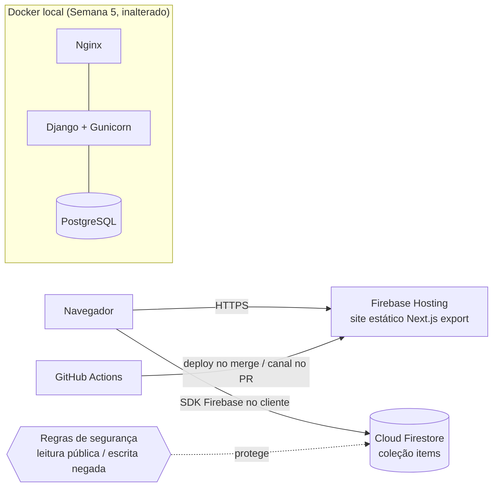

**Fluxo de requisição:**

1. O navegador acessa a URL `.web.app`; o Firebase Hosting entrega os arquivos estáticos gerados por `STATIC_EXPORT=true npm run build` (HTTPS e CDN gerenciados).
2. O JavaScript no cliente lê a variável `NEXT_PUBLIC_DATA_SOURCE`. Em produção ela aponta para `firestore`, e a página consulta a coleção `items` diretamente pelo SDK, recebendo o mesmo formato JSON da API da Semana 5 (`{ "status": "ok", "items": [...] }`).
3. As regras de segurança do Firestore permitem leitura pública e negam toda escrita.
4. Se a fonte de dados falha (por exemplo, `api` sem backend na nuvem), a tela mostra uma mensagem amigável de "dados indisponíveis".

**O que continua no Docker local:** backend Django (Gunicorn), PostgreSQL, Nginx e o build de produção em contêiner (`output: 'standalone'`) da Semana 5. Nada disso foi para a nuvem, pois o plano Spark não inclui Cloud Run nem Cloud SQL.

## 3. Etapa 1 - Projeto e CLI

- **Plano Spark (evidência):** o console exibe o plano **Spark - Sem custos** no canto inferior esquerdo. O botão "Fazer upgrade" nunca foi usado.

  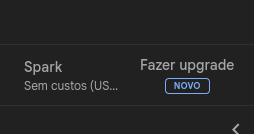

- **Projeto na CLI:** `firebase projects:list` lista o projeto `semana-6-makers` como o projeto atual.

  ```text
  $ firebase projects:list
  Project Display Name | Project ID                    | Project Number | Resource Location ID
  semana-6-makers      | semana-6-makers (current)     | 1007262981849  | [Not specified]
  1 project(s) total.
  ```

  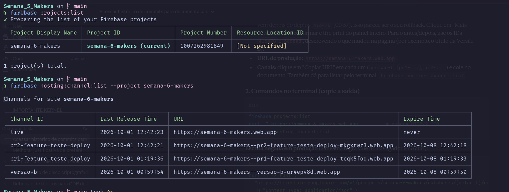

- **Arquivos de configuração:** `firebase.json`, `.firebaserc` e `firestore.rules`, criados com `firebase init` (Hosting e Firestore). A pasta pública do Hosting é a saída do build do frontend: `src/frontend/out`.
- **Higiene do Git:** `firebase-debug.log`, `firestore-debug.log`, `.firebase/` e qualquer JSON de conta de serviço ficam fora do versionamento. A chave de deploy existe apenas como secret do GitHub. A conferência do histórico, feita com os comandos abaixo, não encontrou chave privada nem arquivos de conta de serviço, `.env` ou logs do Firebase:

  ```bash
  git log --all -p -S'private_key' --oneline
  git log --all --name-only --pretty=format: | grep -iE 'service.?account|\.env$|firebase-debug' | sort -u
  ```

  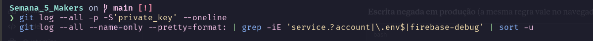
  - **Commit:** [`87710fd`](https://github.com/phenric26/Semana_5_Makers/commit/87710fd9de16f45ef5363ba07998666c71ca91a9) - `chore: configura firebase hosting e firestore`

## 4. Etapa 2 - Deploy mais rápido

- **Modo de exportação:** o `next.config` escolhe o modo por variável de ambiente: `STATIC_EXPORT=true` gera `output: 'export'` (para o Hosting) e, sem ela, mantém `output: 'standalone'` (para o Dockerfile de produção da Semana 5).
- **Estado de erro amigável:** o fetch foi movido para o navegador. Como o backend não existe na nuvem, a página exibe a mensagem de "dados indisponíveis" em vez de tela em branco.
- **Verificação do site publicado:** `curl -I` retorna `HTTP/2 200`, com `content-type: text/html` e `last-modified: Thu, 01 Oct 2026 15:42:24 GMT`, que corresponde ao último deploy do Hosting.

  ```text
  $ curl -I https://semana-6-makers.web.app
  HTTP/2 200
  cache-control: max-age=3600
  content-type: text/html; charset=utf-8
  last-modified: Thu, 01 Oct 2026 15:42:24 GMT
  strict-transport-security: max-age=31556926; includeSubDomains; preload
  content-length: 7006
  ```

  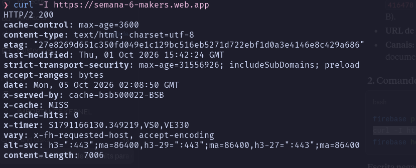

- **Commit:** [`96cb343`](https://github.com/phenric26/Semana_5_Makers/commit/96cb343e1c0fd291c62e7373ab97c1f827bdb7a8) - `feat: adapta next.js para exportação estática e erro de API`

## 5. Etapa 3 - Emulator Suite

- **Configuração dos emuladores:** bloco `emulators` no `firebase.json`: Hosting na porta 5000 (servindo `src/frontend/out`), Firestore na 8080 e a interface do emulador na 4000. A flag `NEXT_PUBLIC_USE_EMULATOR=true` faz o frontend chamar `connectFirestoreEmulator`. Nenhum segredo é versionado: a configuração web do Firebase é pública por design e a segurança está nas regras.
- **Fonte de dados:** `NEXT_PUBLIC_DATA_SOURCE` (`api` ou `firestore`) seleciona a origem. Ambas devolvem o mesmo formato JSON, então a tela não muda.
- **Dados semente:** os 3 itens da Semana 5 foram cadastrados como documentos e exportados com `--export-on-exit` para a pasta `firebase_data/` (que contém `firestore_export/`). O emulador os carrega com:

  ```bash
  firebase emulators:start --import=./firebase_data
  ```

  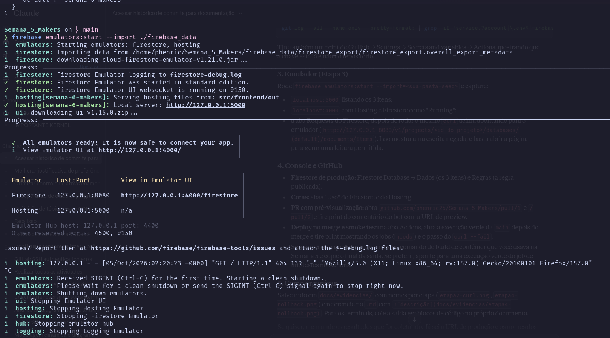

- **Regras:**

  ```
  rules_version = '2';
  service cloud.firestore {
    match /databases/{database}/documents {
      match /items/{item} {
        allow read: if true;
        allow write: if false;
      }
    }
  }
  ```

- **Commit:** [`04794fa`](https://github.com/phenric26/Semana_5_Makers/commit/04794fa4a2c097573a4901a452e76405ad9c51db) - `feat: integra emuladores do firebase e configura seed de dados no firestore`

## 6. Etapa 4 - Firestore de produção e Versão B

- **Regras publicadas:** as mesmas da Etapa 3 (leitura pública, escrita negada em `items`), publicadas com `firebase deploy --only firestore:rules`. Nenhuma regra `allow read, write: if true` em produção.
- **Dados de produção:** Cloud Firestore ativado em modo de produção (plano Spark) e os 3 itens cadastrados pelo console. A página publicada em produção lê o Firestore (status `ok (firebase)`) e lista os 3 itens: "Configurar Docker", "Automatizar CI" e "Publicar no GHCR".

  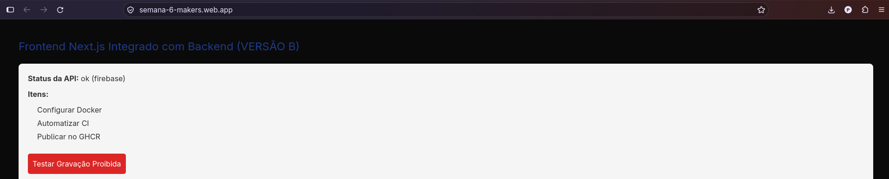

- **Canal da Versão B:** alteração visível feita na página e publicada com `firebase hosting:channel:deploy versao-b --expires 7d`. Produção e canal ficaram no ar ao mesmo tempo:

  | Ambiente              | URL                                                  | Último release      | Expira              |
  | --------------------- | ---------------------------------------------------- | ------------------- | ------------------- |
  | Produção (`live`)     | <https://semana-6-makers.web.app>                    | 2026-10-01 12:42:23 | nunca               |
  | Versão B (`versao-b`) | <https://semana-6-makers--versao-b-ur4epv8d.web.app> | 2026-10-01 00:59:54 | 2026-10-08 00:59:50 |

  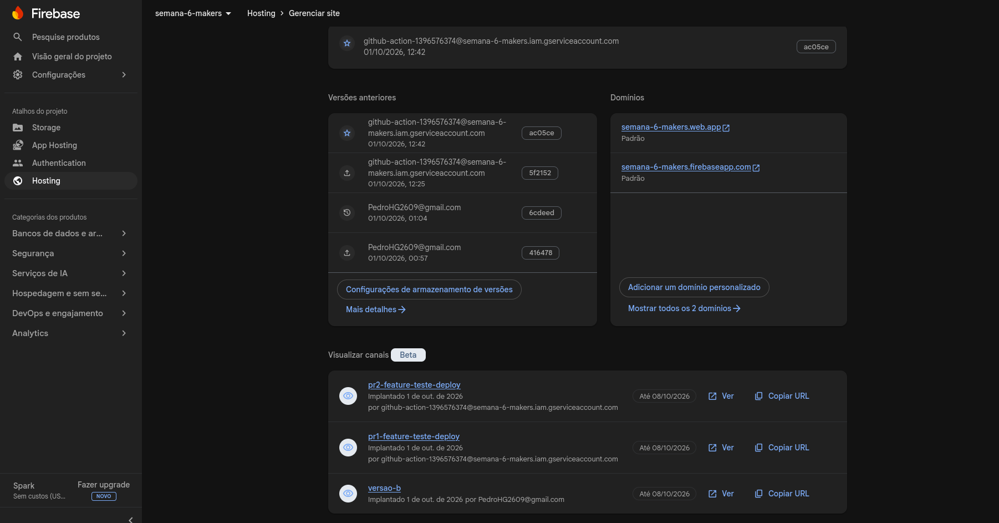

- **Escrita negada em produção (navegador):** o botão "Testar Gravação Proibida" da página publicada tenta gravar um documento em `items` com o SDK. As regras bloquearam a escrita e o navegador exibiu o alerta com a mensagem `Missing or insufficient permissions.` (código `permission-denied`).

  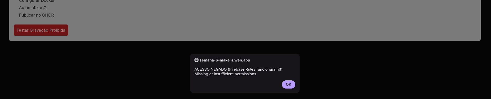

- **Escrita negada em produção (API REST):** a mesma regra também bloqueou uma gravação em `items` feita pela API REST do Firestore, com `403 PERMISSION_DENIED`:

  ```text
  $ curl -i -X POST "https://firestore.googleapis.com/v1/projects/semana-6-makers/databases/(default)/documents/items" \
      -H "Content-Type: application/json" -d '{"fields":{"nome":{"stringValue":"teste"}}}'
  HTTP/2 403
  {
    "error": {
      "code": 403,
      "message": "Missing or insufficient permissions.",
      "status": "PERMISSION_DENIED"
    }
  }
  ```

  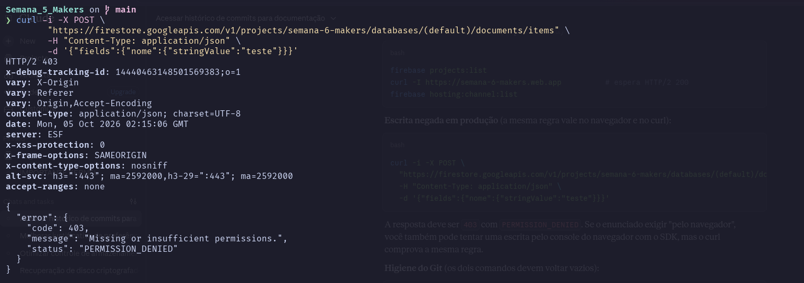

- **Rollback:** o histórico de versões do Hosting registra a restauração `6cdeed` (01/10, 01:04), feita pelo console logo após o deploy `416478` (01/10, 00:57).
- **Commit:** [`088b8ae`](https://github.com/phenric26/Semana_5_Makers/commit/088b8aedec4dc9216a493c79db1488dd8d4c4e9b) - `feat: altera para Versao B e configura conexao com o Firestore de producao`

## 7. Etapa 5 - CD com GitHub Actions

- **Workflow:** criado com `firebase init hosting:github`, que guarda a credencial de deploy como secret do GitHub (a chave não foi para o repositório). O workflow foi ajustado para: lint e testes da Semana 5 → build com `STATIC_EXPORT=true` → deploy, com `needs` entre os jobs e `concurrency` para evitar dois deploys simultâneos. O pipeline está no arquivo `ci.yml` (`.github/workflows/ci.yml`), disparado em `push`, com as trilhas de backend (`lint-backend` → `build-backend` → `test-backend` → `deploy-backend`) e de frontend (`lint-frontend` → `build-frontend` → `test-frontend` → `deploy-frontend`) e, após o `deploy-frontend`, os jobs `Firebase Preview Channel` (apenas em PR) e `Firebase Production Channel`.
- **Preview em PR:** os pull requests da branch `feature/teste-deploy` (#1 e #2) geraram canais de pré-visualização (`pr1-feature-teste-deploy` e `pr2-feature-teste-deploy`), listados na seção 1 e na tabela de canais da Etapa 1. No PR [#2](https://github.com/phenric26/Semana_5_Makers/pull/2), o bot `github-actions` comentou a URL de pré-visualização (atualizada para o commit `c80564a`), com validade até 08/10/2026 15:42 GMT:

  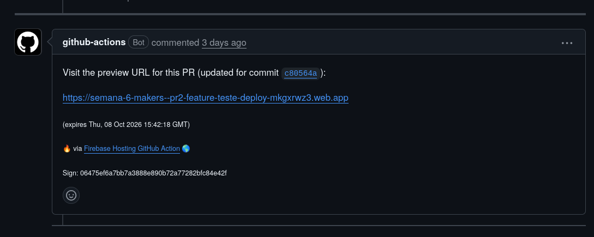

  A URL do comentário, <https://semana-6-makers--pr2-feature-teste-deploy-mkgxrwz3.web.app>, é a mesma do canal `pr2-feature-teste-deploy` listado pelo `firebase hosting:channel:list`.

- **Deploy no merge:** o merge do PR #2 na `main` (commit `acbaeb8`) disparou a execução #22 do workflow [`ci.yml`](https://github.com/phenric26/Semana_5_Makers/actions/workflows/ci.yml), que terminou com sucesso em 3 min 51 s. Todos os jobs de lint, build e teste passaram antes do deploy; o job `Firebase Production Channel` publicou a produção (1 min 19 s) e o `Firebase Preview Channel` foi pulado, como esperado, por não se tratar de um PR. O histórico de versões do Hosting também mostra deploys na produção feitos pela conta de serviço do GitHub Actions (`github-action-...@semana-6-makers.iam.gserviceaccount.com`) em 01/10 às 12:25 e 12:42, sem intervenção manual (imagem da Etapa 4).

  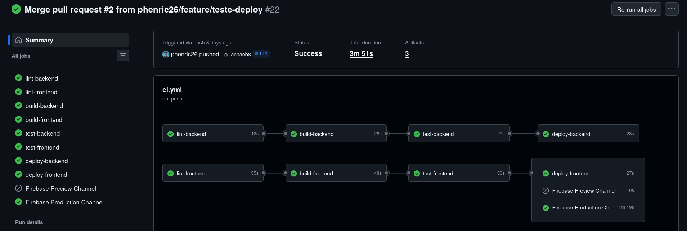

- **Teste de fumaça:** `curl --fail` na URL publicada ao final do deploy. Durante o desenvolvimento a extração da URL com `jq` foi corrigida e, por fim, a URL de produção foi fixada no teste.

  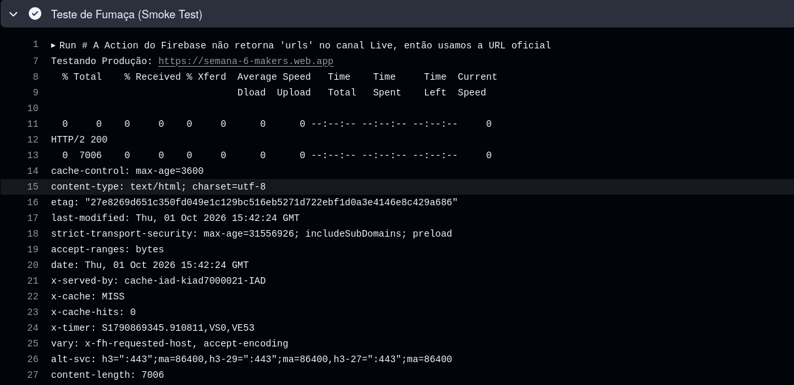

  O passo acessa `https://semana-6-makers.web.app` e recebe `HTTP/2 200` (`content-length: 7006`).

- **Reflexão sobre a chave JSON:**
  Neste cenário a chave de conta de serviço guardada em GitHub Secrets é aceitável: é um projeto de estudo no plano Spark, o repositório não contém a chave, o secret só é exposto aos workflows e a conta de serviço tem escopo limitado ao Hosting. Mesmo assim, é uma credencial de longa duração: se vazar (log, fork malicioso, colaborador), vale até ser revogada, e exige rotação manual. A Workload Identity Federation elimina a chave: o GitHub emite um token OIDC de curta duração e o Google Cloud o troca por credenciais temporárias, restritas por condição de atributo ao seu repositório (e, se quiser, à branch). Ela vale a pena quando há dados reais ou faturamento em jogo, vários repositórios/pessoas, exigências de conformidade ou política de não manter segredos de longa duração. Para um projeto individual de custo zero, o ganho é menor que o custo de configurar.
- **Commits:**
  - [`d6744c4`](https://github.com/phenric26/Semana_5_Makers/commit/d6744c43aeaba5f519413361e5d031eba30da408) - `feat: configura deploy continuo do firebase com smoke tests`
  - [`2ca8d80`](https://github.com/phenric26/Semana_5_Makers/commit/2ca8d80903ff8dc88726747dde4792a29b6a5218) - `fix: corrige extracao da url do firebase com jq`
  - [`bae4d65`](https://github.com/phenric26/Semana_5_Makers/commit/bae4d6597376ced69c41351751b9fe5f7bfa8837) - `Merge pull request #1 from phenric26/feature/teste-deploy`
  - [`acbaeb8`](https://github.com/phenric26/Semana_5_Makers/commit/acbaeb8) - `Merge pull request #2 from phenric26/feature/teste-deploy`
  - [`c80564a`](https://github.com/phenric26/Semana_5_Makers/commit/c80564a458b6d95db5c3759fa02bc9d1b1a0b945) - `fix: hardcode url da producao no teste de fumaca`

## 8. Desenho de produção gerenciada

| Componente da Semana 5    | Serviço equivalente                         | Configuração                                                         |
| ------------------------- | ------------------------------------------- | -------------------------------------------------------------------- |
| Backend Django (Gunicorn) | Cloud Run                                   | Porta do contêiner, conta de serviço própria, escala mínima e máxima |
| Imagens no GHCR           | Artifact Registry                           | Promoção da imagem por SHA de commit                                 |
| PostgreSQL                | Cloud SQL                                   | Conexão segura, migrações em job separado, backups                   |
| Arquivo `.env`            | Secret Manager                              | Papel de acesso somente ao segredo necessário                        |
| Nginx                     | Firebase Hosting + rewrite para o Cloud Run | Mesma origem para o navegador, limites de cookies                    |
| Chaves no GitHub          | Workload Identity Federation                | Condição de atributo restrita ao seu repositório                     |

**Custo mensal estimado** (consulta às páginas de preço em 04/10/2026, em dólares, região de referência `us-central1`).
Premissas: um serviço Django pequeno (1 vCPU, 512 MiB, cobrança por requisição, mínimo de 0 instâncias) com tráfego de um projeto acadêmico, cerca de 1 GB de imagens, um banco PostgreSQL pequeno de 10 GB e poucos segredos.

| Serviço                                                                 | Preço de tabela                                                                                                                                                                                                                                 | Estimativa mensal                                                |
| ----------------------------------------------------------------------- | ----------------------------------------------------------------------------------------------------------------------------------------------------------------------------------------------------------------------------------------------- | ---------------------------------------------------------------- |
| [Cloud Run](https://cloud.google.com/run/pricing)                       | vCPU US$ 0,000024/s e memória US$ 0,0000025/GiB-s em uso, mais US$ 0,40 por milhão de requisições. Cota gratuita mensal: 180.000 vCPU-s, 360.000 GiB-s e 2 milhões de requisições. Exemplo oficial com 10 milhões de requisições/mês: US$ 13,69 | ≈ US$ 0 (dentro da cota gratuita)                                |
| [Artifact Registry](https://cloud.google.com/artifact-registry/pricing) | Primeiros 0,5 GB grátis; US$ 0,10 por GB/mês acima disso                                                                                                                                                                                        | ≈ US$ 0,05 (1 GB)                                                |
| [Cloud SQL (PostgreSQL)](https://cloud.google.com/sql/pricing)          | Instância compartilhada `db-f1-micro` ≈ US$ 8 a 11/mês (US$ 0,015/h em uma das fontes consultadas); SSD US$ 0,17/GB/mês; backups US$ 0,08/GB/mês                                                                                                | ≈ US$ 10,50 a 13,50 (instância + 10 GB de SSD + 10 GB de backup) |
| [Secret Manager](https://cloud.google.com/secret-manager/pricing)       | 6 versões ativas e 10.000 acessos grátis por mês; depois US$ 0,06 por versão ativa/mês e US$ 0,03 por 10.000 acessos                                                                                                                            | ≈ US$ 0 (poucos segredos)                                        |
| Firebase Hosting (rewrite para o Cloud Run)                             | Dentro da cota do Hosting                                                                                                                                                                                                                       | ≈ US$ 0                                                          |
| **Total**                                                               |                                                                                                                                                                                                                                                 | **≈ US$ 10,50 a 13,50 por mês**                                  |

O Cloud SQL responde por quase todo o custo. Os valores da instância e do armazenamento do Cloud SQL foram conferidos em fontes secundárias de preço (Bytebase e NetApp), e os demais nas páginas oficiais; os preços variam por região e por edição, e alta disponibilidade dobraria o valor da instância. Uma região mais barata, o desligamento fora do horário de uso e o uso de HDD reduzem o total.

**Por que o Spark não permite:** Cloud Run, Cloud SQL, Artifact Registry e Secret Manager são produtos do Google Cloud que exigem uma conta de faturamento ativa, mesmo quando o uso cabe na cota gratuita. O Spark não pede cartão e por isso não dá acesso a eles; só o plano Blaze (pago conforme o uso, com cartão) os habilita.

## 9. Custo zero e limites

- **Plano:** Firebase Spark do início ao fim (evidência na Etapa 1).
- **Cotas usadas (Hosting):** no período de 1 de out. a 1 de nov., o armazenamento atual é de 3,68 MB e o total de downloads é de 1017,99 KB, muito abaixo da cota gratuita.

  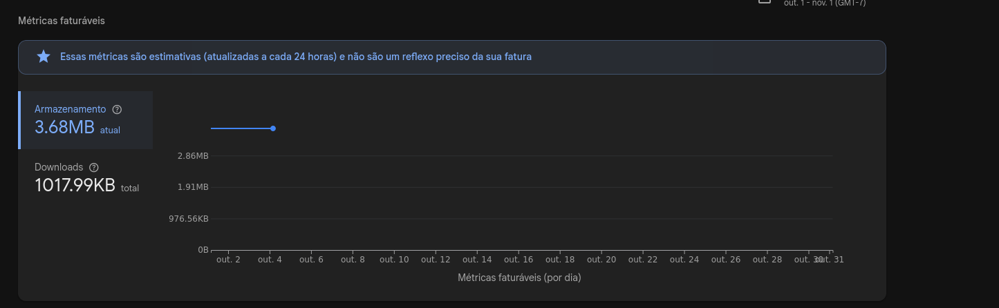

- **Serviços NÃO habilitados:** Cloud Run, Artifact Registry, Cloud Build, Secret Manager, Cloud SQL, Cloud Functions, App Hosting, Cloud Storage, Compute Engine, login por telefone e qualquer serviço que pedisse cartão ou o upgrade para Blaze.

## 10. Validação final

- **Comandos executados:**

  ```bash
  firebase projects:list
  firebase hosting:channel:list --project semana-6-makers
  curl -I https://semana-6-makers.web.app
  curl -i -X POST "https://firestore.googleapis.com/v1/projects/semana-6-makers/databases/(default)/documents/items" \
    -H "Content-Type: application/json" -d '{"fields":{"nome":{"stringValue":"teste"}}}'
  firebase emulators:start --import=./firebase_data
  STATIC_EXPORT=true npm run build            # em src/frontend
  firebase deploy --only hosting
  firebase deploy --only firestore:rules
  firebase hosting:channel:deploy versao-b --expires 7d
  ```

- **Resultados:**
  - `projects:list`: projeto `semana-6-makers` (atual).
  - `hosting:channel:list`: canais `live`, `pr2-feature-teste-deploy`, `pr1-feature-teste-deploy` e `versao-b`, com expiração em 08/10/2026 para os três últimos.
  - `curl -I` na produção: `HTTP/2 200`.
  - Escrita em `items` na produção: `403 PERMISSION_DENIED`.
  - Emuladores: Firestore (8080) e Hosting (5000) iniciados com o seed importado de `firebase_data`.
  - Página de produção: lista os 3 itens do Firestore (`ok (firebase)`).
  - Botão "Testar Gravação Proibida": alerta com `Missing or insufficient permissions.`
  - Workflow `ci.yml` (execução #22): todos os jobs verdes, deploy em produção concluído e teste de fumaça com `HTTP/2 200`.

## 11. Histórico Git

| Etapa      | Commit                                                                                                    | Descrição                                                                                                |
| ---------- | --------------------------------------------------------------------------------------------------------- | -------------------------------------------------------------------------------------------------------- |
| 1          | [`87710fd`](https://github.com/phenric26/Semana_5_Makers/commit/87710fd9de16f45ef5363ba07998666c71ca91a9) | Configura Firebase Hosting e Firestore (`firebase.json`, `.firebaserc`, `firestore.rules`, `.gitignore`) |
| 2          | [`96cb343`](https://github.com/phenric26/Semana_5_Makers/commit/96cb343e1c0fd291c62e7373ab97c1f827bdb7a8) | Next.js com exportação estática por `STATIC_EXPORT` e estado de erro amigável na API                     |
| 3          | [`04794fa`](https://github.com/phenric26/Semana_5_Makers/commit/04794fa4a2c097573a4901a452e76405ad9c51db) | Emuladores do Firebase, fonte de dados por variável e dados semente do Firestore                         |
| 4          | [`088b8ae`](https://github.com/phenric26/Semana_5_Makers/commit/088b8aedec4dc9216a493c79db1488dd8d4c4e9b) | Versão B e conexão com o Firestore de produção                                                           |
| 5          | [`d6744c4`](https://github.com/phenric26/Semana_5_Makers/commit/d6744c43aeaba5f519413361e5d031eba30da408) | Deploy contínuo com GitHub Actions e testes de fumaça                                                    |
| 5 (ajuste) | [`2ca8d80`](https://github.com/phenric26/Semana_5_Makers/commit/2ca8d80903ff8dc88726747dde4792a29b6a5218) | Corrige extração da URL do Firebase com `jq`                                                             |
| 5 (merge)  | [`bae4d65`](https://github.com/phenric26/Semana_5_Makers/commit/bae4d6597376ced69c41351751b9fe5f7bfa8837) | Merge do PR #1 (`feature/teste-deploy`)                                                                  |
| 5 (merge)  | [`acbaeb8`](https://github.com/phenric26/Semana_5_Makers/commit/acbaeb8)                                  | Merge do PR #2 (`feature/teste-deploy`), que disparou a execução #22 do `ci.yml`                         |
| 5 (ajuste) | [`c80564a`](https://github.com/phenric26/Semana_5_Makers/commit/c80564a458b6d95db5c3759fa02bc9d1b1a0b945) | Fixa a URL de produção no teste de fumaça                                                                |
