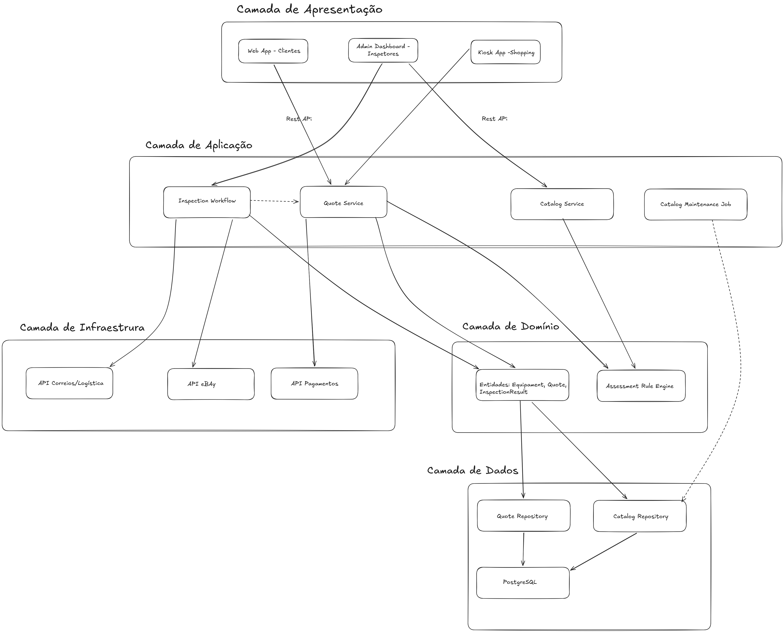

# Architectural Kata — Going Green

*Arquitetura em Camadas para o sistema de reciclagem eletrônica*

## Enunciado - Going Green

A large electronics store wants to get into the electronics recycling business and needs a new system to support it. Customers can send in their small personal electronic equipment (or use local kiosks at the mall) and possibly get money for their used equipment if it is in working condition.

Users: Hundreds, hopefully thousands to millions

Requirements:

Customers can get a quote for used personal electronic equipment (phones, cameras, etc.) either through the web or a kiosk at a mall.
Customers will receive a box in the mail, send in their electronic, and if it is in good working order receive a check.
Once the equipment is received, it is assessed (inspected) to determine if it can be either recycled (destroyed safely) or sold (eBay, etc.).
The company anticipates adding 5-10 new types of electronic that they will accept each month.
Each type of electronic has its own set of rules for quoting and assessment.

Additional Context:

This is a highly competitive business and is a new line of business for us.
If we haven't received a type of electronic equipment in a year we will remove it from our system.
We need to maintain a list of electronic equipment we are willing to accept as it changes often.
Each piece of equipment has its own assessment (inspection) rules.
We have the right to change the original quote to the customer if the product isn't in the condition they said it was.

## 1. Estrutura das Camadas

O sistema é organizado em cinco camadas empilhadas, seguindo o estilo de arquitetura em camadas (Layered Architecture). A comunicação segue sempre de fora para dentro: Apresentação → Aplicação → Domínio → Dados, com a camada de Infraestrutura acessada pela Aplicação para integrações externas.

### Apresentação 
- **Web App** — acesso de clientes de casa, para solicitar cotação (SPA).
- **Kiosk App** — interface para os totens instalados nos shoppings.
- **Admin Dashboard** — interface para os funcionários que realizam a inspeção física do equipamento recebido.

### Aplicação 
- **Quote Service** — orquestra o pedido de cotação inicial e a revisão da cotação após a inspeção física.
- **Inspection Workflow** — gerencia o processo a partir do momento em que o item chega fisicamente à empresa, incluindo o registro do resultado da inspeção.
- **Catalog Service** — gerencia a adição mensal de novos tipos de eletrônicos aceitos e suas regras associadas.
- **Catalog Maintenance Job** — processo agendado responsável por remover do catálogo os tipos de equipamento sem recebimento há mais de um ano. Não é acionado por uma requisição do usuário, e sim por um gatilho de tempo.

### Domínio 
- **Entidades** — Equipment, Quote, InspectionResult.
- **Assessment Rule Engine** — motor de regras de negócio isolado, onde ficam as estratégias de precificação e de inspeção específicas de cada tipo de eletrônico.

### Dados
- **Catalog Repository** — acesso à lista de equipamentos aceitos (afetado diretamente pelo Catalog Maintenance Job).
- **Quote Repository** — persistência das cotações feitas, aceitas e revisadas.

### Infraestrutura 
- **Módulo de Logística** — integração com API dos Correios, para envio da caixa ao cliente e rastreio do equipamento devolvido.
- **Módulo de Pagamento** — emissão de cheques/transferências ao cliente após aprovação da inspeção.
- **Integração Marketplaces** — comunicação com a API do eBay para revenda dos equipamentos aprovados na inspeção.

## 2. Diagrama da Arquitetura

## 4. Justificativa

A arquitetura em camadas escolhida atende aos requisitos do "Going Green" ao aplicar uma forte separação de preocupações, isolando na camada de Apresentação a complexidade omnichannel (Web, Kiosk e Admin Dashboard consumindo os mesmos serviços) e, principalmente, na camada de Domínio o Assessment Rule Engine, o que permite alterar as regras de precificação e inspeção a cada novo tipo de eletrônico sem impactar a lógica da Aplicação, essa mesma camada de Aplicação materializa dois requisitos centrais do negócio, a revisão da cotação original quando o equipamento chega em condição diferente da declarada, via comunicação entre Inspection Workflow e Quote Service, e o expurgo anual de tipos de equipamento sem recebimento, via um Catalog Maintenance Job agendado e não uma chamada síncrona, enquanto a natureza do ciclo completo (cotação → envio → inspeção → pagamento), reforça a necessidade de processamento assíncrono orientado a eventos entre esses serviços.Por fim, a Infraestrutura abstrai as integrações logísticas e de vendas (eBay) e a Dados garante a persistência e o expurgo do catálogo.