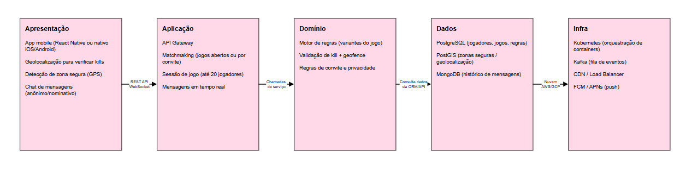

# Arquitetura em Katas

## Mobile Assassins: The Game
O Kata proposto, **Mobile Assassins: The Game**, consiste em criar um jogo interativo no mundo real que mistura caça e execução de tarefas. Nele, cada participante recebe um alvo específico para rastrear e "eliminar" presencialmente, ao mesmo tempo em que precisa cumprir objetivos e descobrir quem são os impostores ou perseguidores ao seu redor. A arquitetura precisa ser projetada para uma carga massiva, suportando milhões de usuários ativos divididos em centenas de milhares de partidas simultâneas, com até 20 jogadores por sala.

## Diagrama
Para estruturar os requisitos descritos no Kata, foi elaborado o seguinte diagrama de arquitetura:

*Figura 1 — Diagrama de arquitetura do sistema Mobile Assassins: The Game desenvolvido no Draw.io.*

Essa arquitetura atende aos requisitos do jogo porque cada camada cuida de uma parte específica do problema, sem misturar responsabilidades. O app mobile (Apresentação) usa geolocalização para confirmar as mortes e detectar zonas seguras, além de permitir o chat entre jogadores. A camada de Aplicação organiza as partidas, sejam abertas ou por convite, controla o limite de 20 jogadores e cuida das mensagens em tempo real. O Domínio guarda as regras do jogo e valida se uma "morte" é válida, verificando a localização. Os Dados armazenam tudo de forma organizada: jogadores, jogos, localização e mensagens, cada tipo de informação no banco mais adequado. E a Infra garante que o sistema aguente milhares de jogos acontecendo ao mesmo tempo, além de entregar as notificações e mensagens diárias aos usuários. Assim, o sistema fica preparado tanto para o uso atual quanto para crescer com as funcionalidades futuras, como realidade aumentada e ranking de jogadores.