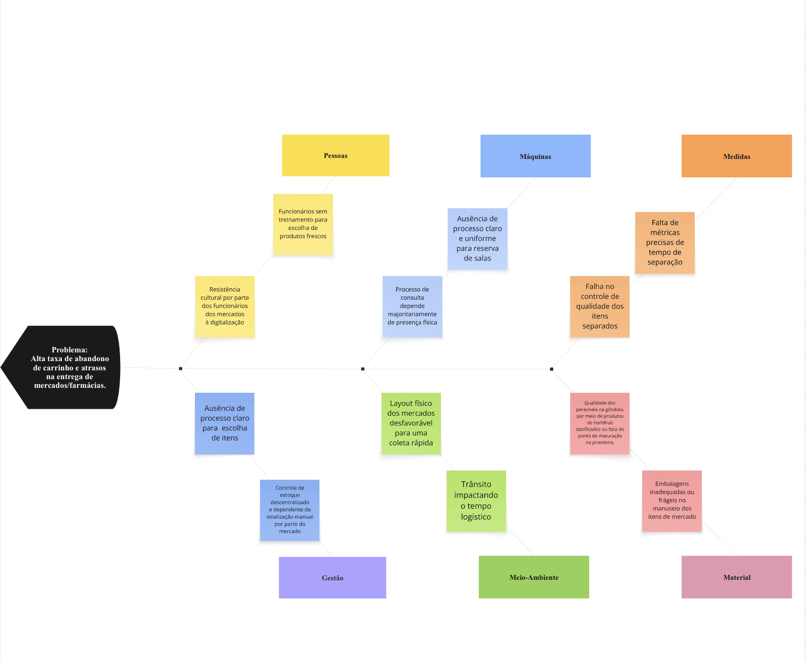

# Visão do Produto e do Projeto

# 1. CENÁRIO ATUAL DO CLIENTE E DO NEGÓCIO

# 1.1 Introdução ao Negócio e Contexto
Zest é uma plataforma digital de delivery que opera sobre um modelo de marketplace, atuando como um intermediário entre consumidores, mercados e lojas de conveniências.O principal intuito da empresa é oferecer conveniência e eficiência logística. A concepção e popularização do serviço ganharam força durante a época da pandemia do covid-19, período que restringiu o funcionamento presencial do comércio e influenciou na necessidade de um novo mercado digital  para as empresas. A Zest insere-se neste cenário maduro, onde a demanda por inovações em usabilidade e logística contínua em expansão, o principal objetivo de atender jovens adultos com rotinas aceleradas, estabelecimentos locais que precisam expandir a base de clientes e profissionais autônomos que buscam por flexibilidade na geração de renda por meios digitais.

# 1.2 Identificação da Oportunidade ou Problema
O mercado de food delivery no Brasil já está muito consolidado, porém mesmo assim tem uma janela de melhoria e inovação que os grandes players não conseguem resolver de forma eficiente. As principais oportunidades de modernização dentro da Zest focam no segmento de mercados, mercearias e farmácias, através dos seguintes pontos:
Diminuir a exigência de um “pedido mínimo”: Usuários que precisam de compras de emergência ou pedidos menores acabam sendo barrados por esses limites que geralmente são de valores muito altos (entre R$70 e R$120), o que gera frustração e alto índice de abandono de carrinho. A Zest enxerga a oportunidade de capturar esse público perdido.
Melhor sincronização do estoque em tempo real e interfaces não otimizadas para compras de múltiplos itens.
Diminuir o tempo de entrega para produtos de mercados e conveniência, atualmente os pedidos de mercados e farmácias passam por alta taxa de espera

# 1.3 Desafios do Projeto
A maior dificuldade é uma arquitetura de dados capaz de integrar ao sistema de gestão de estoque dos mercados parceiros em tempo real com alta consistência na disponibilidade dos produtos sem que tenha sobrecarga dos servidores. Do ponto de vista lógico o desafio é tornar esses pedidos menores viáveis financeiramente, tanto para plataforma quanto para o entregador. Exigindo um desenvolvimento de um algoritmo de (batching), consistindo na separação das compras por lotes próximos, facilitando as entregas e aumentando o lucro das compras. Além disso, promover uma mudança na cultura dos mercados de aceitarem colaborar para uma modernização do sistema de compras como um todo, desde os funcionários até os clientes. Sendo necessário uma capacitação por parte dos funcionários para o melhor funcionamento da escolha de frutas,verduras e alimentos.

# 1.4 Segmentação de Clientes
Tem como público-alvo três perfis diferentes: Consumidor final (Pessoas que buscam praticidade no dia a dia, com grande foco em jovens que moram sozinhos), Estabelecimentos (Lugares que buscam ampliar o seu público adquirido no ponto físico, uma forma de digitalizar o estabelecimento), Entregadores (Profissionais autônomos buscando uma fonte de renda extra e flexibilidade no trabalho).

# 2. SOLUÇÃO PROPOSTA

# 2.1 Objetivos do Produto
O objetivo desse produto é consolidar a Zest como a principal plataforma digital de delivery de conveniência e mercado, oferecendo compras de qualquer volume (refeições, itens unitários de mercado). A solução visa eliminar essa barreira do pedido mínimo e diminuir o tempo de entrega de mercados e farmácias, facilitando o dia a dia do usuário que busca mais praticidade e agilidade no seu cotidiano.

# 2.2 Características da Solução
- Fim do pedido mínimo com uma “ taxa de cesto pequeno” : Pedidos abaixo do “valor mínimo” não vão ser bloqueados mas recebem uma pequena taxa de conveniência, garantindo que tenha uma viabilidade para o aplicativo e os entregadores.
- Módulo de Picking e Batching: Algoritmos que agrupam pequenos pedidos de uma mesma região para um único entregador, e uma interface dedicada para o separador (shopper) no mercado otimizar a coleta pelos corredores.

# 2.3 Tecnologias a Serem Utilizadas
Hospedagem dentro da Amazon AWS: Oferecendo serviços de computação em nuvem
Banco de dados: PostgreSQL para dados relacionais
Python para ciência de dados e programação de modelos de IA
Kotlin para o backend, por ser muito compatível com o ecossistema do java, com uma escrita mais moderna e segura contra erros comuns de código, além da integração com o mobile
React (Typescript/ Javascript) para o frontend criando componentes visuais rápidos e reaproveitáveis

# 2.4 Pesquisa de Mercado e Análise Competitiva
- iFood: Excelente para restaurantes mas com uma interface para supermercados adaptada de forma ineficiente. Impõe rigorosos limites de pedido mínimo.
- Zé Delivery: Focado em ultra-conveniência, mas restrito para nichos muito específicos (bebidas) e dependente da infraestrutura própria das lojas.
A solução da Zest irá se diferenciar por:
- Experiência do usuário de compras de baixo volume: plataforma que permite as compras emergenciais de 1 ou 2 itens sem bloqueio no carrinho.
- Integração visual de lista de compras: UX desenhada especificamente para lista de compras e integração com estoque e promoções disponíveis, superando o design atual da concorrência. 

# 2.5 Análise de Viabilidade
A viabilidade técnica do projeto é bem alta, baseando-se na expertise do time de engenharia na construção de microsserviços robustos e escaláveis. 
Em termos de prazo, estima-se um desenvolvimento de oito a dez meses, dividido em sprints quinzenais. As primeiras entregas seriam voltadas à remoção do pedido mínimo e à taxa de cesto pequeno, por serem mudanças de menor complexidade técnica e alto impacto imediato na experiência do usuário. O módulo de Picking e Batching, por depender de um algoritmo de otimização logística mais robusto, é tratado como a entrega mais crítica do cronograma, com uma fase extra de testes em campo junto a mercados parceiros piloto antes do lançamento em escala.
Quanto à viabilidade de mercado, a oportunidade está validada pela lacuna deixada por concorrentes como iFood e Zé Delivery, que não atendem bem esse segmento de compras de baixo volume e alta frequência. O mercado de food delivery no Brasil já é maduro, mas o nicho de conveniência e compras emergenciais de mercado/farmácia segue pouco explorado, o que reduz o risco de entrada tardia e aumenta as chances de captura rápida de usuários insatisfeitos com as limitações atuais da concorrência.

# 2.6 Impacto da Solução
- Aumento do volume de pedidos e captura de novo público: a remoção do pedido mínimo e a taxa de cesto pequeno devem atrair o público que hoje abandona o carrinho ou nem chega a - iniciar a compra por conta dos limites de valor, ampliando a base de usuários ativos e a frequência de uso do aplicativo.
Diferenciação competitiva: ao resolver problemas que iFood e Zé Delivery não endereçam de forma eficiente, a Zest se posiciona como referência em conveniência e compras de baixo volume, um espaço ainda pouco disputado dentro de um mercado consolidado.

# Arquitetura Kata
Problema encontrado dentro do site architecturalkatas.com

Diagrama de arquitetura em camadas

