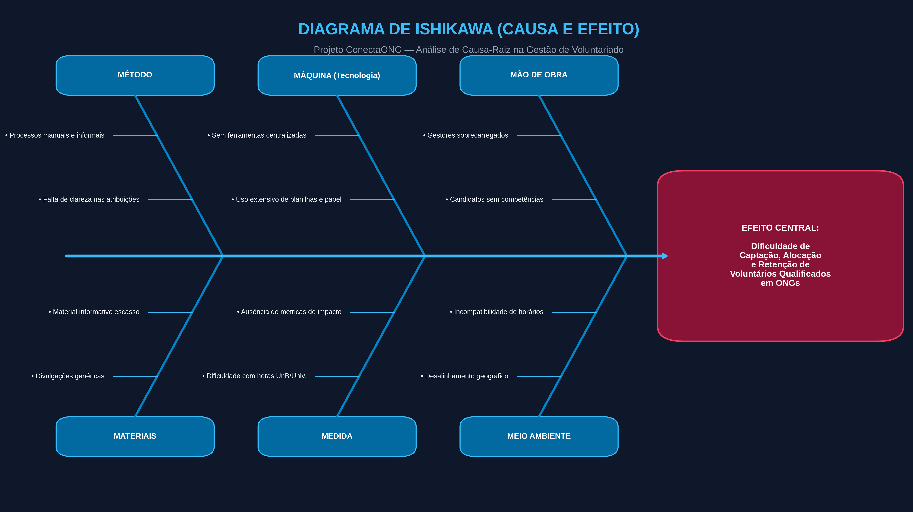

# ConectaONG — Rede Social Cívica e Voluntariado por Competências

**VISÃO DO PRODUTO E PROJETO**  
**Versão:** 1.0  
**Data:** 30/08/2026  
**Autor:** Matheus Ribeiro Szervinsk 
**Instituição:** Universidade de Brasília (UnB - Campus Gama / FGA)  

---

## 1 CENÁRIO ATUAL DO CLIENTE E DO NEGÓCIO

### 1.1 Introdução ao Negócio e Contexto
O Terceiro Setor desempenha um papel essencial no suporte a causas humanitárias, educacionais, ambientais e de proteção animal no Brasil. Contudo, milhares de Organizações Não Governamentais (ONGs) e coletivos comunitários enfrentam dificuldades crônicas de sustentação operacional devido à escassez de recursos financeiros e de pessoal capacitado. 

Paralelamente, cresce o interesse da sociedade civil, principalmente de jovens universitários e profissionais qualificados, em participar de ações de impacto social. No entando, o modelo tradicional de engajamento baseia-se em divulgações pulverizadas, processos manuais e informais de recrutamento, gerando incompatibilidade de horários, desalinhamento de expectativas e alto índice de desistência.

A **ConectaONG** surge como uma plataforma cívica desenhada para reestruturar essa dinâmica sociotécnica, conectando voluntários a causas sociais de forma inteligente, baseada em competências técnicas, localização geográfica e disponibilidade de agenda.

### 1.2 Identificação da Oportunidade ou Problema
As ONGs gastam tempo excessivo tentando triar e treinar voluntários genéricos, enquanto profissionais com habilidades especializadas não encontram oportunidades objetivas para contribuir pontualmente. Esse cenário resulta em ineficiência na triagem, alta taxa de abandono, sobrecarga dos gestores e dificuldade em proteger dados sensíveis. 

A oportunidade consiste em centralizar e automatizar esse fluxo, resolvendo o problema de alocação de mão de obra qualificada no Terceiro Setor.

### 1.3 Desafios do Projeto
O principal desafio técnico e operacional do projeto consiste em criar uma experiência fluida para dois públicos com perfis de maturidade digital altamente divergentes. De um lado, jovens voluntários que exigem interfaces dinâmicas e móveis; de outro, gestores de ONGs comunitárias que frequentemente possuem baixo letramento tecnológico e precisam de fluxos extremamente simplificados.

Adicionalmente, há o desafio de estabelecer um mecanismo robusto de verificação de autenticidade das ONGs cadastradas para evitar fraudes ou uso indevido da plataforma, garantindo a conformidade com a Lei Geral de Proteção de Dados (LGPD).

### 1.4 Segmentação de Clientes
A solução atende a dois perfis principais de clientes:
* **Voluntários Universitários e Jovens Profissionais:** Usuários com alto letramento tecnológico que buscam flexibilidade, agilidade móvel, feedback imediato e comprovação formal de horas para exigências acadêmicas ou enriquecimento de currículo.
* **Gestores de ONGs e Coletivos Comunitários:** Usuários com letramento tecnológico heterogêneo (frequentemente baixo a intermediário), sobrecarregados com demandas operacionais de campo. Necessitam de painéis visuais simples e textos objetivos sem jargões técnicos.

---

## 2 SOLUÇÃO PROPOSTA

### 2.1 Objetivos do Produto
O objetivo geral da solução é otimizar a captação, alocação e retenção de voluntários qualificados em ONGs e projetos comunitários, reduzindo a ociosidade operacional e o abandono de causas sociais. O produto visa acelerar essa alocação através de um sistema de *matchmaking*, reduzir o tempo gasto por gestores com triagem manual, e garantir a credibilidade do engajamento por meio de certificação automatizada.

### 2.2 Características da Solução
* **Matchmaking por Competências e Geolocalização:** Algoritmo que filtra e sugere oportunidades com base em *skills*, raio de distância e disponibilidade do voluntário.
* **Painel Simplificado de Gestão da ONG:** Interface visual para publicação de vagas, aceite de voluntários e controle de presenças, eliminando o uso de planilhas paralelas.
* **Emissão Automatizada de Certificados:** Geração de documento em PDF com validação criptográfica (QR Code) para comprovação de horas complementares.
* **Perfil do Voluntário e Histórico de Impacto:** Dashboard pessoal exibindo horas doadas e causas apoiadas para estimular o engajamento contínuo.
* **Módulo de Segurança e Privacidade (LGPD):** Controle granular de visibilidade de contatos e proteção contra vazamento de dados sensíveis.

### 2.3 Tecnologias a Serem Utilizadas
* **Frontend Mobile/Web:** React Native e React.js para garantir uma interface responsiva e intuitiva em múltiplos dispositivos.
* **Backend:** Node.js fornecendo uma API RESTful de alta performance, com suporte a WebSocket para comunicação.
* **Banco de Dados:** PostgreSQL para armazenar dados relacionais estruturados e MongoDB para logs de eventos.
* **Autenticação & Segurança:** OAuth 2.0, JWT e criptografia AES-256 para proteger os dados dos usuários.

### 2.4 Pesquisa de Mercado e Análise Competitiva
No mercado brasileiro, existem plataformas como o **Atados** (focado em grandes campanhas corporativas e eventos pontuais) e o **Transforma Brasil** (focado em ações comunitárias genéricas de ampla escala). 

A **ConectaONG** irá se diferenciar dessas soluções por focar estritamente no *Skills-Based Volunteering*, atraindo voluntários para tarefas técnicas que geram valor estrutural (ex: criação de sites, suporte contábil). Além disso, contará com certificação nativa voltada ao cumprimento das diretrizes de extensão universitária e uma usabilidade adaptativa para líderes comunitários não técnicos.

### 2.5 Análise de Viabilidade
A proposta demonstra alta viabilidade técnica e de prazo, considerando que será executada com tecnologias dominadas pela equipe de desenvolvimento e um escopo delimitado focado no MVP (Produto Mínimo Viável). O fluxo inicial englobará apenas as funcionalidades essenciais: cadastro, publicação de vagas, *matchmaking* básico e emissão de certificados, o que garante a entrega sustentável da solução no tempo estimado.

### 2.6 Impacto da Solução
Espera-se que a plataforma atue como um vetor de transformação social, gerando os seguintes benefícios:
* **Para as ONGs:** Democratização do acesso a talentos qualificados, redução de custos operacionais com serviços técnicos e profissionalização da gestão de voluntariado.
* **Para os Voluntários:** Facilidade em encontrar causas diretamente alinhadas aos seus valores e formação acadêmica, proporcionando desenvolvimento prático de habilidades e obtenção de certificação auditável. 
* **Impacto Global:** Fortalecimento das redes de solidariedade local e redução das taxas de desistência em projetos sociais.